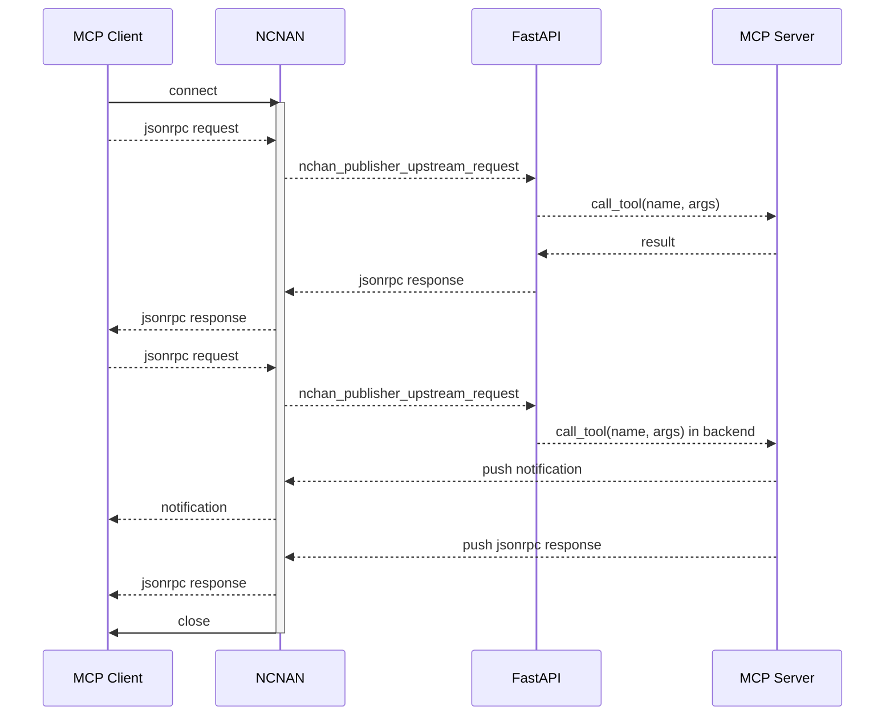

# MCP Communication Flow Documentation

This document describes the communication flow between MCP Client, NCNAN, FastAPI, and MCP Server components.

## Overview

The sequence diagram below illustrates the JSON-RPC based communication protocol used in the MCP (Model Control Protocol) system. It shows how requests flow from the client through various components and how responses and notifications are delivered back.

## Component Descriptions

- **MCP Client**: The client application that initiates requests to the MCP system.
- **NCNAN**: NCHAN adapter that handles WebSocket connections and message routing.
- **FastAPI**: API service that processes requests and communicates with the MCP Server.
- **MCP Server**: Backend server that processes tool calls and generates responses.

## Communication Flow Explanation

### Initial Connection and Simple Request

1. **Connection Establishment**:
   - MCP Client initiates a connection to NCNAN
   - NCNAN activates and establishes the communication channel

2. **Basic Request-Response Flow**:
   - Client sends a JSON-RPC request to NCNAN
   - NCNAN forwards the request to FastAPI via nchan_publisher_upstream_request
   - FastAPI calls the appropriate tool on the MCP Server with specified arguments
   - MCP Server processes the request and returns the result to FastAPI
   - FastAPI constructs a JSON-RPC response and sends it back through NCNAN
   - NCNAN delivers the response to the MCP Client

### Advanced Request with Notifications

3. **Request with Background Processing**:
   - Client sends another JSON-RPC request to NCNAN
   - Request is forwarded through NCNAN to FastAPI
   - FastAPI initiates a background tool call on the MCP Server

4. **Notification and Response Handling**:
   - While processing, MCP Server sends push notifications through NCNAN
   - NCNAN forwards these notifications to the MCP Client in real-time
   - After completion, MCP Server pushes the final JSON-RPC response
   - NCNAN delivers the response to the MCP Client
   - Finally, NCNAN closes the connection with the client

## Common Use Cases

This communication pattern is particularly useful for:
- Long-running operations that require progress updates
- Real-time feedback during model execution
- Stateful operations that need to maintain connection context

## Implementation Notes

When implementing clients for this protocol, ensure proper handling of:
- Connection interruptions
- Notification message processing
- Request-response correlation using JSON-RPC IDs
